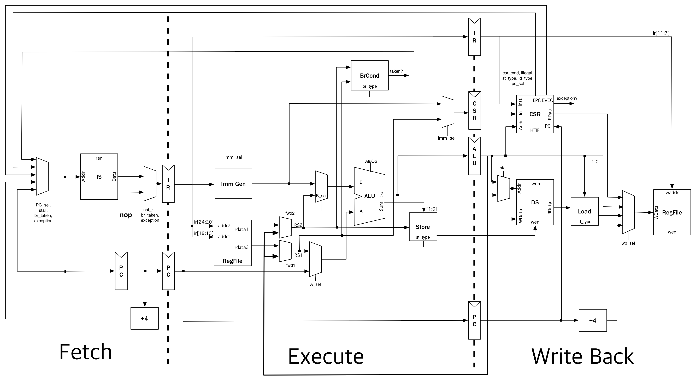

# riscv-mini

Author: Donggyu Kim (dgkim@eecs.berkeley.edu)

`riscv-mini` is a simple RISC-V 3-stage pipeline written in Chisel. It has been a crucial example in various project developments,
including [Chisel3](https://github.com/ucb-bar/chisel3.git), [FIRRTL](https://github.com/ucb-bar/firrtl.git),
[Strober](http://www.strober.org), simulation and verification methodologies.
It implements RV32I of the User-level ISA Version 2.0 and the Machine-level ISA of the Privileged Architecture Version 1.7.
Unlike other simple pipelines, it also contains simple instruction and data caches.

Note that the goal of `riscv-mini` is not a realistic processor.
It is developed as an intermediate example before diving into [rocket-chip](https://github.com/ucb-bar/rocket-chip). 

## Datapath Diagram

## Getting Started

    $ git clone https://github.com/ucb-bar/riscv-mini.git
    $ cd riscv-mini
    $ git submodule update --init
    $ make publish    # you need to local-publish firrtl due to sbt's limitation
    $ make            # this will give you the firrtl & verilog output files in generated-src
    
The verilog output file can be used for the ASIC tools,
as provided in [strober-examples](https://github.com/donggyukim/strober-examples) with [plsi](https://github.com/ucb-bar/plsi).
    
## Tests

`riscv-mini` provides *theoretically* synthesizable unit & integration tests.
Theres are six sets of unit tests(`ALUTests`, `BrCondTests`, `ImmGenTests`, `CSRTests`, `CacheTests`, `DatapathTests`),
running user-defined test vectors.
To execute them, first launch `sbt` and run:

    > testOnly mini.[testname]
  
There are also six sets of integration tests, running the hex files from [riscv-tests](https://github.com/riscv/riscv-tests).
To execute them, also launch `sbt` and run:

    > testOnly mini.[Core|Tile][Simple|ISA|Bmark]Tests
    
`Core` only contains the datapath and the control unit, while `Tile` also contains I$ and D$. `Simple` only runs `rv32ui-p-simple`,
`ISA` runs the whole ISA tests, and `Bmark` runs five benchmarks(`median`, `multiply`, `qsort`, `towers`, `vvadd`). 
Note that all tests in a set run in parallel.

Finally, to run all the tests, just in sbt:

    > test
    
## FAQ

Coming soon.
